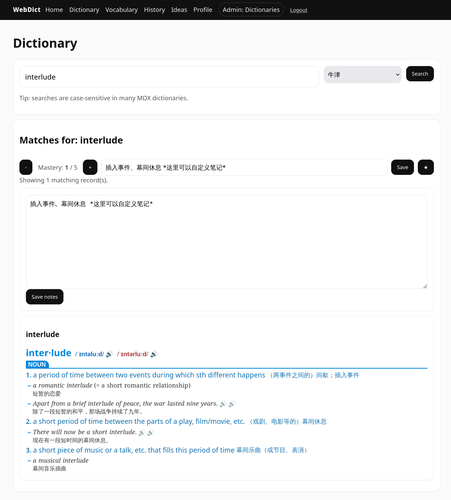
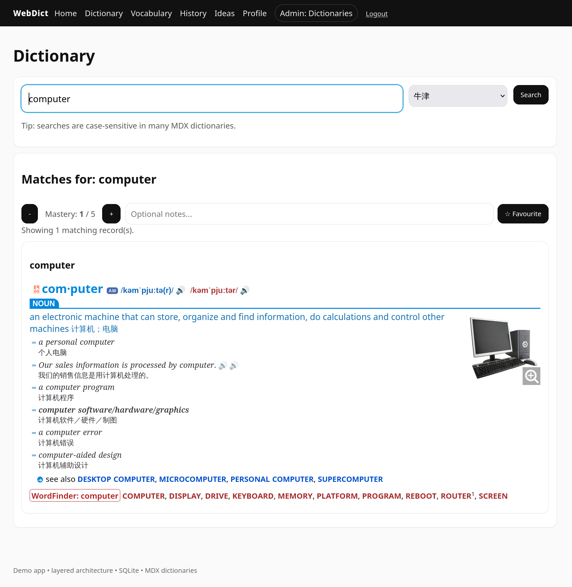
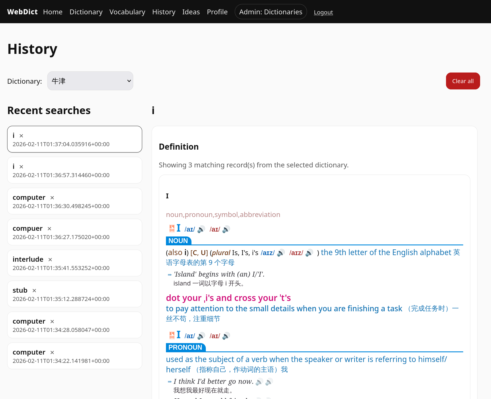
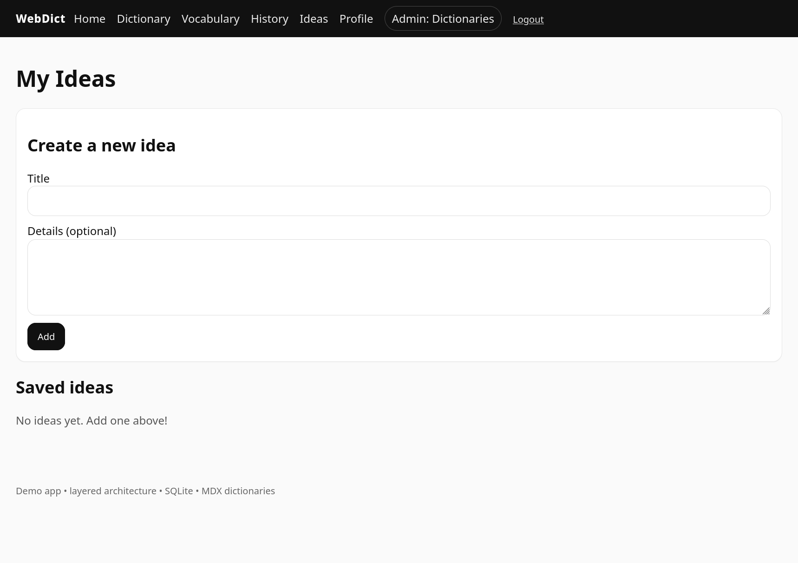
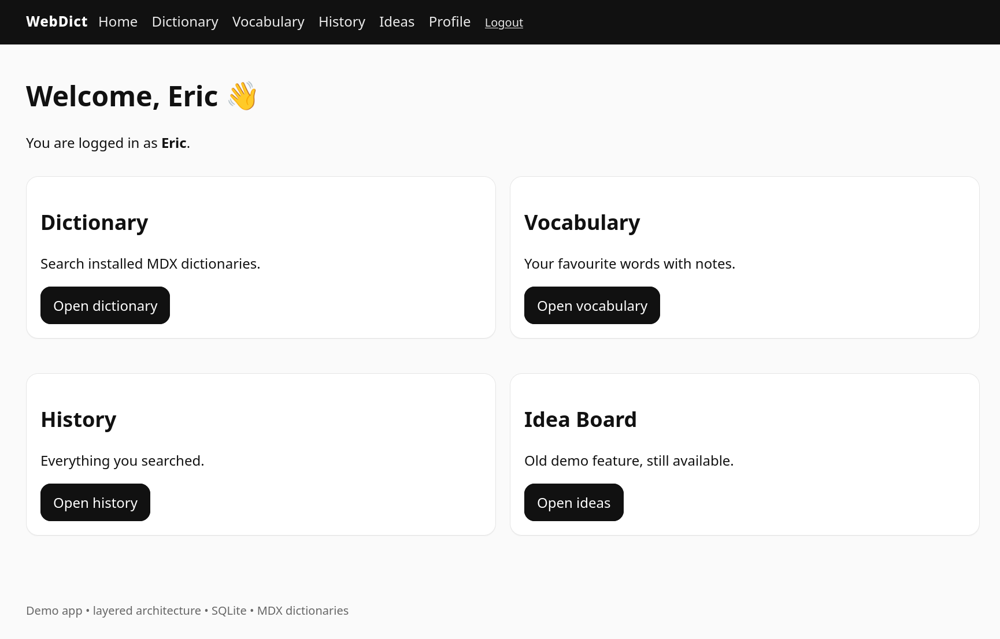

# Python FastAPI Dictionary App [MDX]

This is an experimental web-based dictionary application capable of loading any external MDX dictionaries. It may serve as an alternative GoldenDict on Linux.

### Features

* Favourite or unfavourite a word.
* Add personal notes to a word.
* Record the mastery level for a word.
* Export or import your vocabulary list.
* View your search history.
* Use the Idea Board feature to record random thoughts.

---









---


Extended app:
- keeps **Idea Board**
- adds **MDX Dictionary** + **Vocabulary** + **History**
- adds **Admin dictionary manager**

## Run

```bash
sudo pacman -S uv # This line depends on your OS or distribution
cd fastapi-web-dictionary
uv sync
uv run uvicorn app.main:app
```

Open http://127.0.0.1:8000

## Admin
All new users are normal users (`users.is_admin = 0`).
To make an admin, update DB manually:

```sql
UPDATE users SET is_admin = 1 WHERE username = 'yourname';
```

Admin can upload a dictionary ZIP (must contain exactly one `.mdx`), optional `.mdd`, `.css`, images, etc.

Recommend using `sqlitebrowser` to edit the database.

## MDX Assets

Put all the `.mdx`, `.mdd`, and `.css` files (if they exist) of a dictionary into a **ZIP archive** before uploading them to the app.
